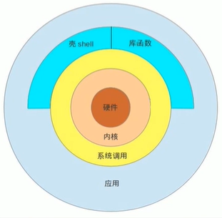

# devops-shell-project

#### Description
Shell script storage project (this warehouse is used to store system operation and maintenance scripts)

It is convenient for operation and maintenance personnel to select the intended script for testing and modification. A good script can study and test with me.

Common progress and common development.

#### Software Architecture
Software architecture description



The hardware of computer equipment, such as processors, memory, storage, and other hardware devices;

Kernel: the core of an operating system; The kernel is the most basic part of the operating system, but it is not the whole of the operating system. The kernel manages the system's processes, memory, device drivers, files, and network systems, and determines the system's performance and stability. And the operating system generally includes the kernel, the driver, the interface library and so on.

System Calls: Users who want to use the operating system need to access the interfaces. These interfaces are called system calls.

The Shell is the user interface of the Linux system, which provides an interface for users to interact with the kernel. It receives the command input from the user and sends it to the kernel for execution. The Shell is also known as Linux's Command Interpreter. The Shell is a high-level programming language.

The Shell itself is a program that breaks down the command lines entered by the user into "command names" and "arguments". Then, according to the command name to find the corresponding program to be executed, the program to be executed to initialize, and then just resolved parameters passed to the program and execute

Shell is a high-level programming language that provides variables, functions, conditional judgments, loops, and other development language functions

Since the Shell itself is a program, it can be replaced by any user-developed Shell.

#### Installation

1.  CentOS：

```bash
sudo yum install -y git
```

1.  Ubuntu：

```bash
sudo apt install -y git
```

1.  Create a new directory, then perform `git clone` to download the project repository

```bash
git clone git@gitee.com:zhong_zhi_wei/devops-shell-project.git
```

#### Instructions

1.  Select the appropriate script for '`bash`' execution, format:

```bash
bash [bash_name].sh
```

#### Contribution

1.  Fork the repository
3.  Commit your code
4.  Create Pull Request


#### Gitee Feature

1.  You can use Readme\_XXX.md to support different languages, such as Readme\_en.md, Readme\_zh.md
2.  Gitee blog [blog.gitee.com](https://blog.gitee.com)
3.  Explore open source project [https://gitee.com/explore](https://gitee.com/explore)
4.  The most valuable open source project [GVP](https://gitee.com/gvp)
5.  The manual of Gitee [https://gitee.com/help](https://gitee.com/help)
6.  The most popular members  [https://gitee.com/gitee-stars/](https://gitee.com/gitee-stars/)