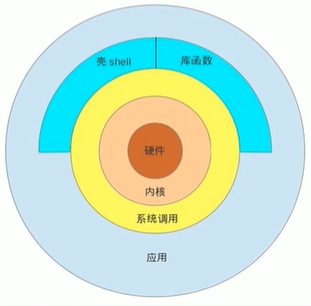

# devops-shell-project

#### 介绍

Shell脚本存放项目（该仓库由于存放系统运维脚本）

方便运维人员选择心意的脚本进行测试和修改。若由优秀的脚本可以与我一道进行研究和测试。

共同进步，共同发展。

#### 软件架构

软件架构说明



硬件：计算机设备的硬件，例如：处理器，内存，存储等等硬件设备；

内核：即是操作系统的核心；内核是操作系统最基本的部分，但不是操作系统的全部。内核负责管理系统的进程、内存、设备驱动程序，文件和网络系统，决定着系统的性能和稳定性。而操作系统一般包括内核、驱动程序、接口库等等组成部分。

系统调用：用户想要使用操作系统是需要通过接口来访问的，这些接口就是系统调用。

Shell 是 Linux 系统的用户界面，提供了用户与内核进行交互操作的一种接口。它接收用户输入的命令并把它送入内核去执行。Shell 也被称为 Linux 的命令解释器（Command Interpreter）Shell 是一种高级程序设计语言。

Shell本身就是一个程序，将用户输入的命令行拆解为"命令名" 与 "参数"。接着，根据命令名找到对应要执行的程序，对被执行的程序进行初始化，然后将刚才解析出来的参数传递给该程序并执行

Shell 是一种高级程序设计语言，提供了变量，函数，条件判断，循环等开发语言的功能

由于Shell 本身是个程序，所以它可以被任何用户自己开发的各种Shell所代替。


#### 安装教程

1.  CentOS 系统：

```bash
sudo yum install -y git
```

1.  Ubuntu 系统：

```bash
sudo apt install -y git
```

1.  新建一个目录，然后执行`git clone`下载项目仓库

```bash
git clone git@gitee.com:zhong_zhi_wei/devops-shell-project.git
```

#### 使用说明

1.  选择合适的脚本进行 `bash` 执行即可，格式：

```bash
bash [bash_name].sh
```

#### 参与贡献

1.  Fork 本仓库
2.  提交代码
3.  新建 Pull Request


#### 特技

1.  使用 Readme\_XXX.md 来支持不同的语言，例如 Readme\_en.md, Readme\_zh.md
2.  Gitee 官方博客 [blog.gitee.com](https://blog.gitee.com)
3.  你可以 [https://gitee.com/explore](https://gitee.com/explore) 这个地址来了解 Gitee 上的优秀开源项目
4.  [GVP](https://gitee.com/gvp) 全称是 Gitee 最有价值开源项目，是综合评定出的优秀开源项目
5.  Gitee 官方提供的使用手册 [https://gitee.com/help](https://gitee.com/help)
6.  Gitee 封面人物是一档用来展示 Gitee 会员风采的栏目 [https://gitee.com/gitee-stars/](https://gitee.com/gitee-stars/)      